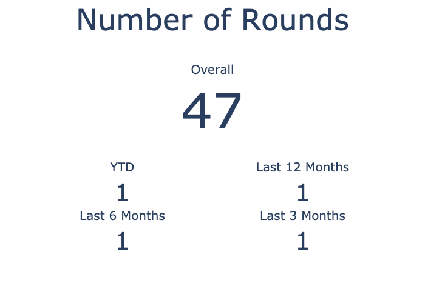
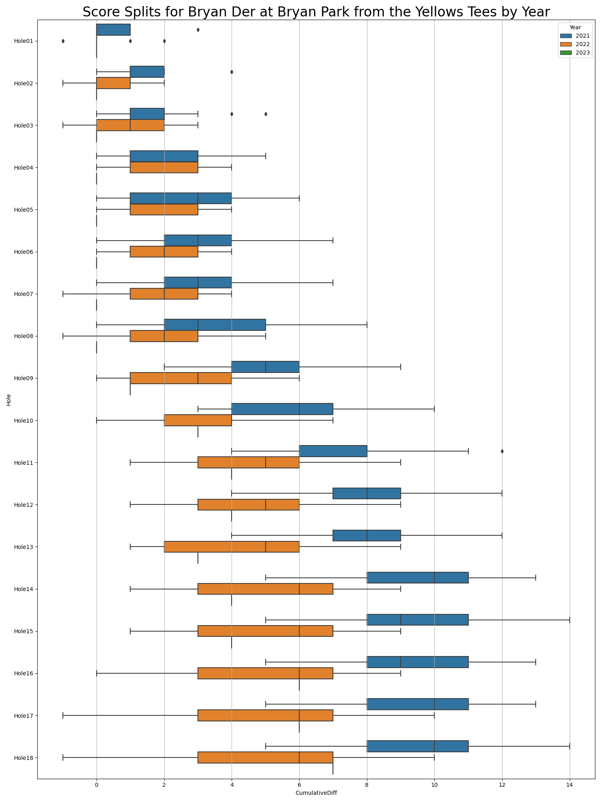

# Stats for Bryan Der at Bryan Park from the Yellows Tees

## Summary Statistics

### Number of Rounds

### Best Round

### Average Scores

## Calendar of Played Rounds

## Score Per Round Metrics

### Average Scores By Month

### Scores With Windowed Averages

### Number of Birdies/Pars/Bogies/Etc Over Time

## Score Per Hole Metrics

### Scores Per Hole

### Cumulative Score Splits Per Hole

#### Overall Cumulative Score Splits Per Hole

#### Per Year Cumulative Score Splits Per Hole

