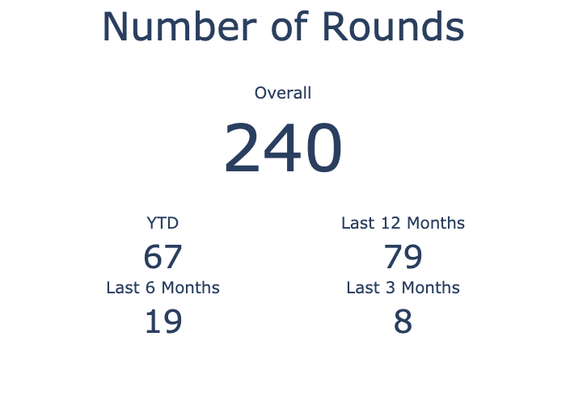
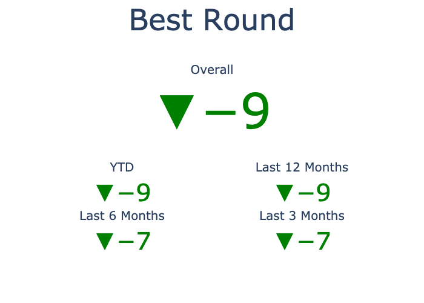
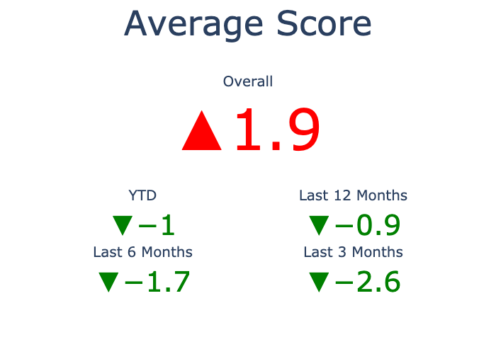
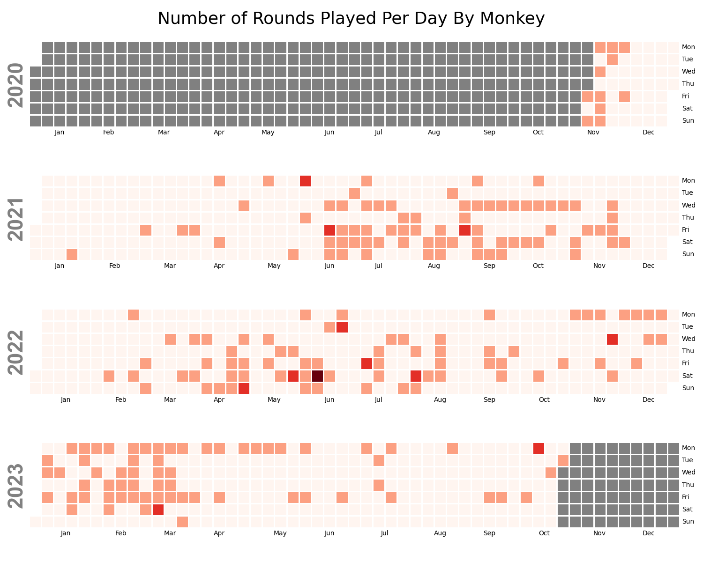
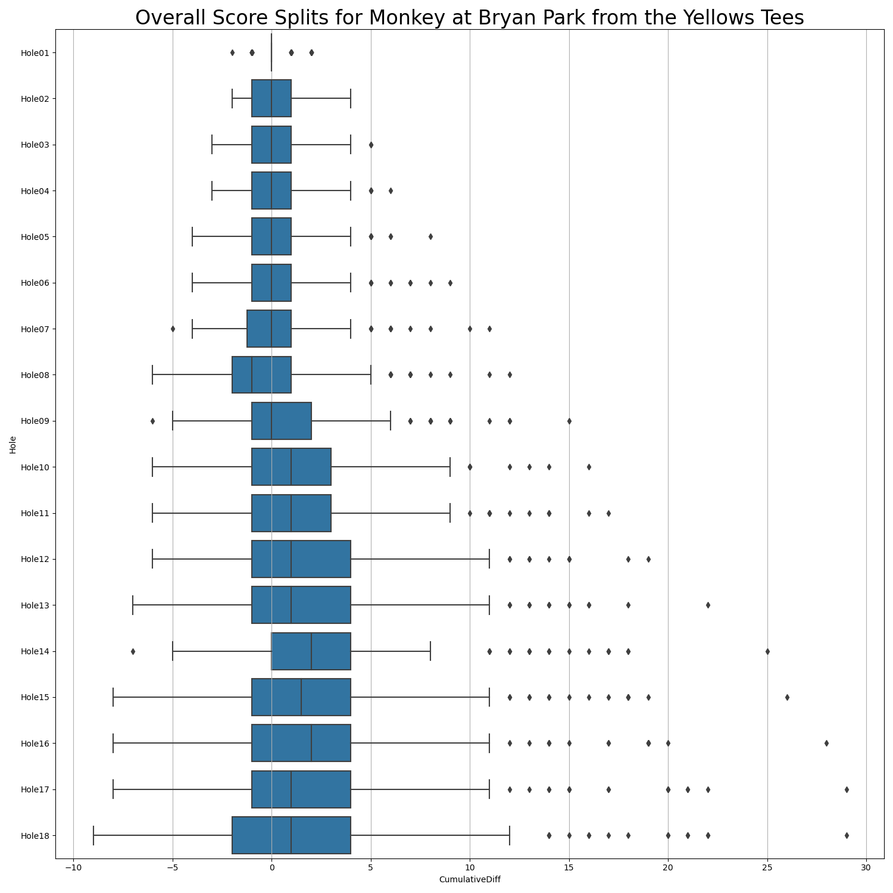

# Stats for Monkey at Bryan Park from the Yellows Tees

Includes rounds up until 2023-11-03 21:20:00

## Summary Statistics

### Number of Rounds

### Best Round

### Average Scores

## Calendar of Played Rounds

## Score Per Round Metrics

### Average Scores By Month

### Scores With Windowed Averages

### Number of Birdies/Pars/Bogies/Etc Over Time

## Score Per Hole Metrics

### Overall Scores Per Hole

### YTD Scores Per Hole

### Cumulative Score Splits Per Hole

#### Overall Cumulative Score Splits Per Hole

#### Per Year Cumulative Score Splits Per Hole

