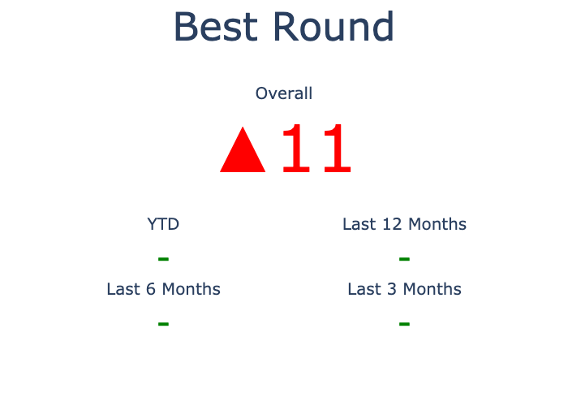
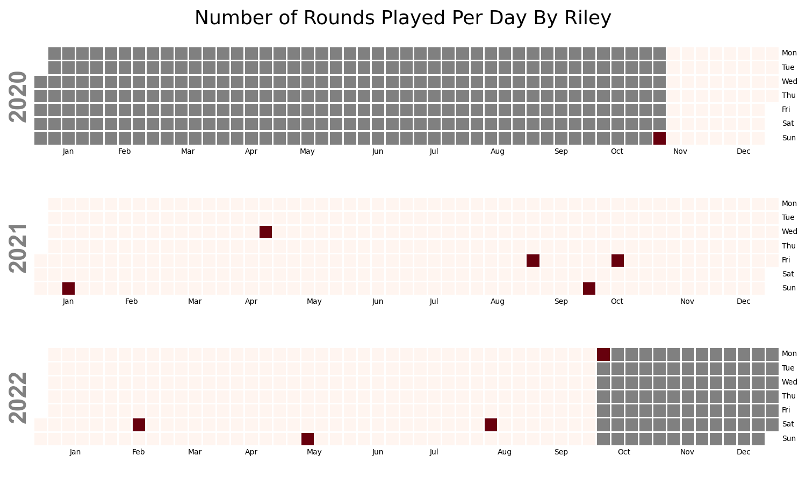
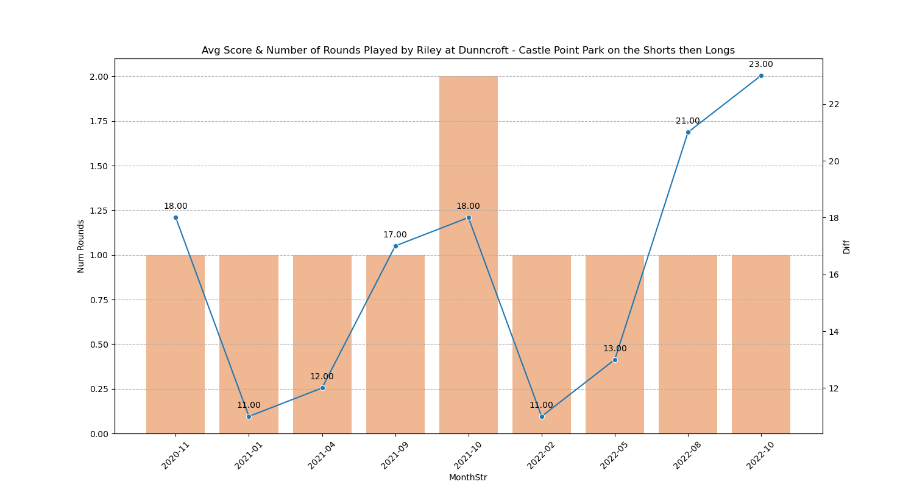
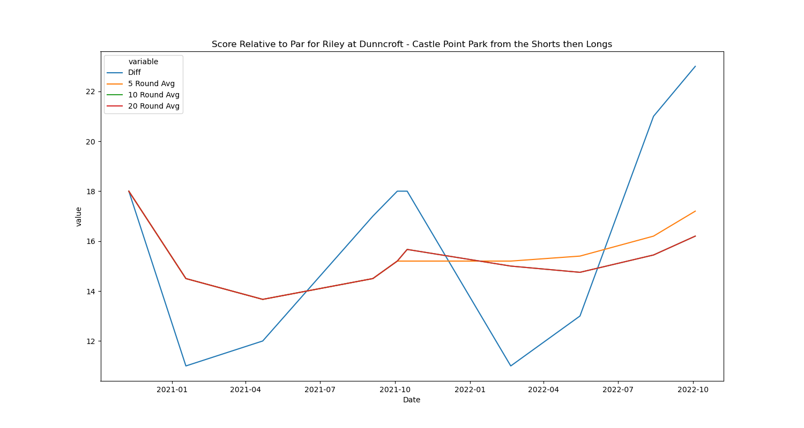
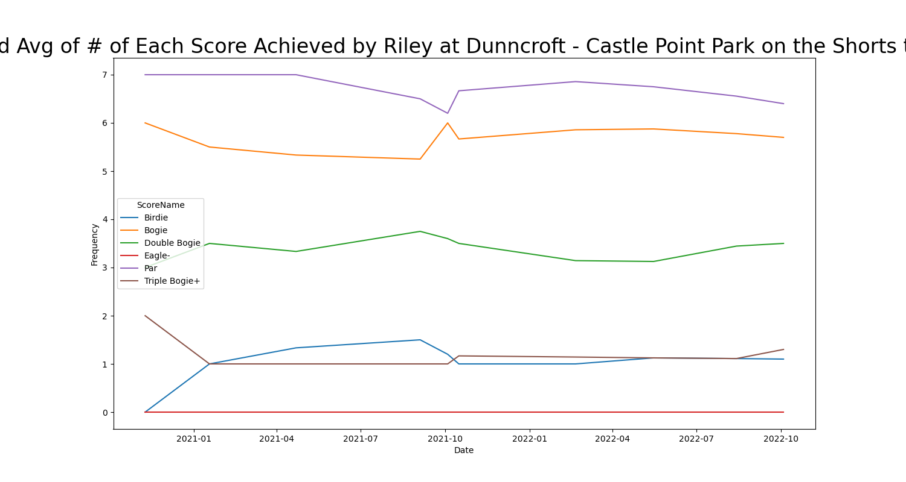
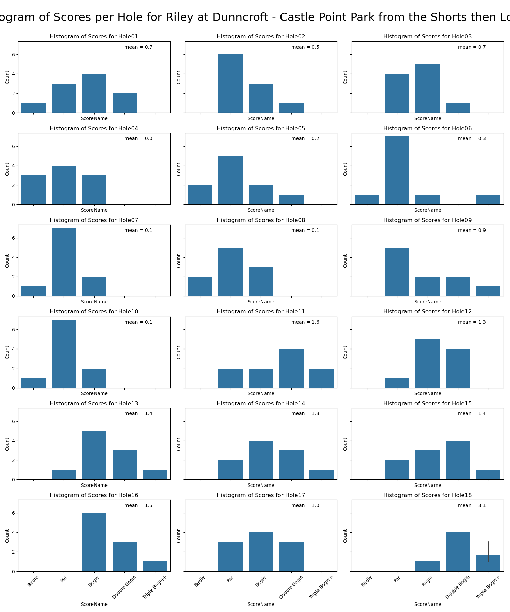
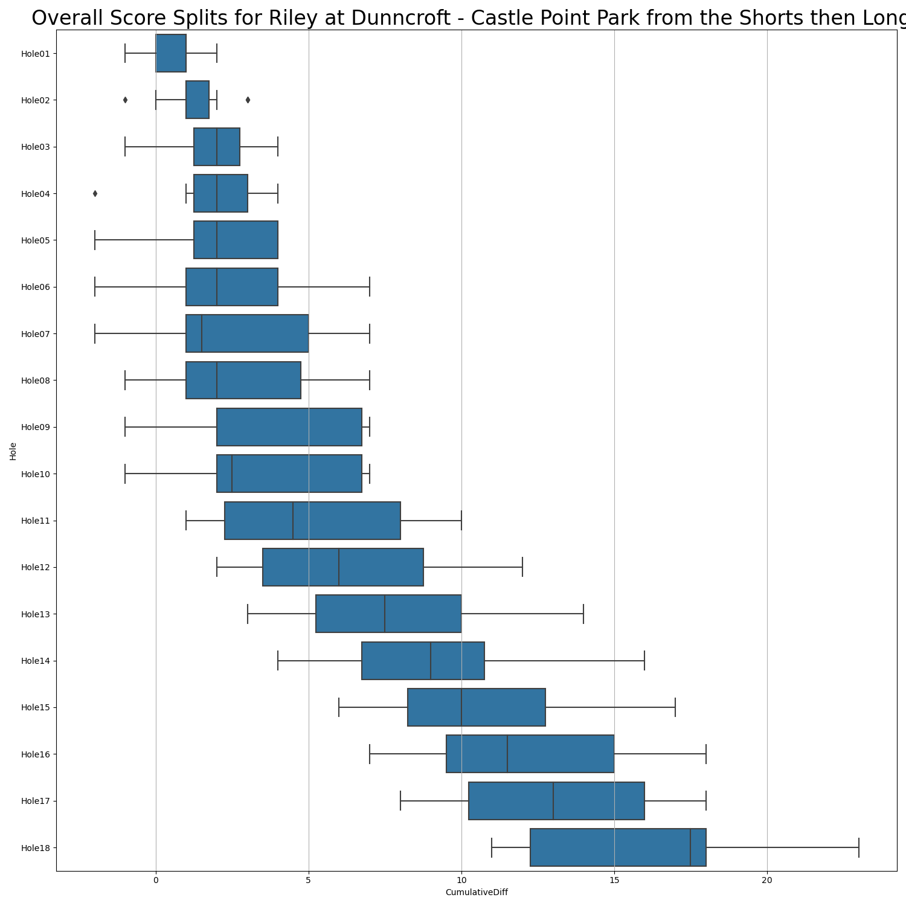
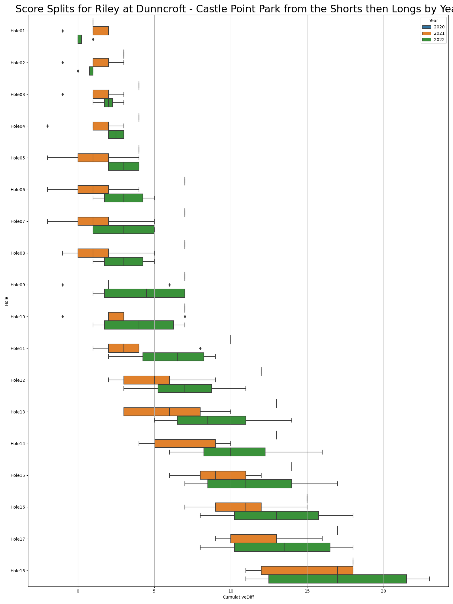

# Stats for Riley at Dunncroft - Castle Point Park from the Shorts then Longs

## Number of Rounds

## Best Round

## Calendar of Played Rounds

## Score Per Round Metrics

### Average Scores By Month

### Scores With Windowed Averages

### Number of Birdies/Pars/Bogies/Etc Over Time

## Score Per Hole Metrics

### Scores Per Hole

### Cumulative Score Splits Per Hole

#### Overall Cumulative Score Splits Per Hole

#### Per Year Cumulative Score Splits Per Hole

